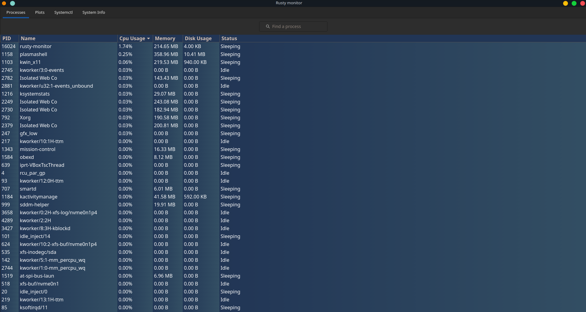

# Rusty-monitor

This is a simple system monitor built with Rust and GTK. It displays various system information in real-time including CPU usage, memory usage and and easy to use interface for systemctl daemons.

This project is **not** assotiated with the Rust Foundation

### Process page

### Graphs page

# Warning

This is an work in progress repo.

## Todo 
- [x] List of processes
- [x] Signals for processes
- [x] Change order of processes
- [x] Plots of system usage 
- [x] Systemctl Page (Current)
- [x] About the system page

## License

This system monitor is released under the GPLv3 License. See the LICENSE file for more details.

# Acknowledgements

This project was developed with the invaluable guidance of Professor Paul Andrew Crocker from the Universidade da Beira Interior. 
